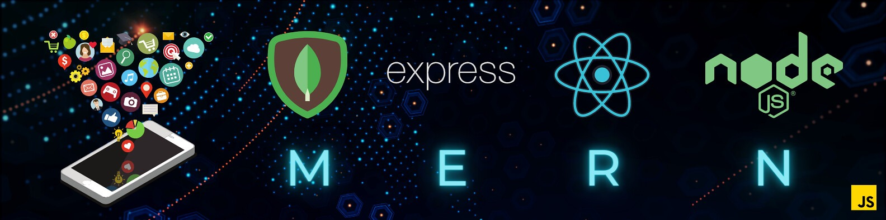

<h1 align="center">Hello 👋, I'm Sighakolli Venkata Ram Vijesh</h1>

<h3 align="center">👨‍💻 Passionate MERN Stack Developer</h3>

  ✍️ I’m currently learning <b>ReactJS, NodeJS, ExpressJS, MongoDB</b> 
  💼 Checkout my Portfolio 👉 <a href="https://vijesh-website.vercel.app/home.html" target="_blank">My Portfolio</a> 
  📧 Reach me at: <a href="mailto:ramsighakolli@gmail.com">My mail</a>

    
  

  

### 🌐 Connect with me:

  
  
  
  
  
  
  
  

---

### 🛠️ Languages and Tools:

  
  
  
  
  
  
  
  
  
  
  
  
  
  
  
  
  
  
  
  
  

<h3>🚀 My Experience </h3>

  &nbsp;&nbsp;
  
  &nbsp;&nbsp;&nbsp;&nbsp;&nbsp;&nbsp;&nbsp;&nbsp;
  

<h3>🚀 My Projects</h3>

  <table> <tr> <td>  </td> <td style="vertical-align: top; padding-left: 20px;"> <strong>Description:</strong> A MERN stack web app to schedule and track fitness coach sessions.   <strong>Tech Stack:</strong> Node.js, Express.js, MongoDB   🌐 <a href="https://hotel-booking-3t8u.onrender.com/" target="_blank">Live Demo</a>  💻 <a href="https://github.com/vijesh567/Hotel-Booking" target="_blank">GitHub Repo</a> </td> </tr> </table>

<table> <tr> <td>  </td> <td style="vertical-align: top; padding-left: 20px;"> <strong>Description:</strong> A real-time Meeting video, chat app  to collaborate with everyone.   <strong>Tech Stack:</strong> React.js, JavaScript    <a href="https://github.com/vijesh567/WeatherApp" target="_blank">GitHub Repo</a> </td> </tr> </table>

<table> <tr> <td>  </td> <td style="vertical-align: top; padding-left: 20px;"> <strong>Description:</strong> A MERN-based applaiton collaborate and working with talents.   <strong>Tech Stack:</strong> MongoDB, Express.js, React.js, Node.js, Socket.IO   💻 <a href="https://github.com/vijesh567/chatapp" target="_blank">GitHub Repo</a> </td> </tr> </table>

  

  

---
==============================================================================================================================================
🧭 1️⃣ పరిచయం (Introduction)

నీ గురించి చిన్న పరిచయం ఇవ్వాలి:

# 👋 హలో, నేను సిఘకొల్లి వెంకట రామ్ విజయేష్  
### 👨‍💻 ఆతురత కలిగిన MERN స్టాక్ డెవలపర్

👉 ఇక్కడ నువ్వు ఎవరు, ఏ రంగంలో నిపుణుడివో చెప్పు:

నేను MERN స్టాక్ (MongoDB, Express, React, Node.js) లో నైపుణ్యం కలిగిన ఫుల్‌స్టాక్ డెవలపర్‌ని.
ఆధునిక వెబ్ యాప్స్‌ను రూపొందించడం, కొత్త టెక్నాలజీలను నేర్చుకోవడం నాకు ఇష్టం.

💡 2️⃣ నా గురించి (About Me)

కొంచెం వ్యక్తిగత వివరాలు ఇవ్వు:

- 🌱 ప్రస్తుతం నేర్చుకుంటున్నవి: **ReactJS, NodeJS, ExpressJS, MongoDB**  
- 💼 నా పోర్ట్‌ఫోలియో చూడండి 👉 [My Portfolio](https://vijesh-website.vercel.app/home.html)  
- 📧 సంప్రదించండి: **ramsighakolli@gmail.com**

✅ ఎమోజీలను ఉపయోగిస్తే చూడటానికి బాగుంటుంది.

🌐 3️⃣ నన్ను సంప్రదించండి (Connect With Me)

ఇది ఇతర డెవలపర్లు, ఫ్రెండ్స్, రిక్రూటర్లు నీతో కనెక్ట్ అవ్వడానికి:

నన్ను సోషల్ మీడియా లేదా కోడింగ్ ప్లాట్‌ఫార్మ్స్‌లో ఫాలో అవ్వండి 👇

అన్ని లింకులను బ్యాడ్జ్‌ల రూపంలో ఇవ్వు (Twitter, LinkedIn, LeetCode మొదలైనవి).

  

🛠️ 4️⃣ భాషలు మరియు సాధనాలు (Languages and Tools)

ఇది నీ టెక్ స్కిల్స్‌ను చూపిస్తుంది:

నేను తరచుగా ఉపయోగించే టెక్నాలజీలు 👇

  
  
  ...

వాటిని ఇలా వర్గీకరించు:

ఫ్రంట్‌ఎండ్: HTML, CSS, React, Redux, Tailwind, Bootstrap

బ్యాక్‌ఎండ్: Node.js, Express.js

డేటాబేస్‌లు: MongoDB, MySQL, PostgreSQL

టూల్స్: Git, Docker, Postman, AWS, Figma

🧑‍💻 5️⃣ అనుభవం (Experience)

నీ ఇంటర్న్‌షిప్‌లు లేదా ప్రాజెక్ట్ అనుభవాలు చెప్పు:

నేను అనేక వెబ్ ప్రాజెక్ట్స్ మరియు టీమ్ వర్క్‌లో పాల్గొని ప్రాక్టికల్ అనుభవం సంపాదించాను.

కంపెనీ లోగోలు లేదా సర్టిఫికేట్లు ఇక్కడ జతచేయి:

  
  

🚀 6️⃣ ప్రాజెక్టులు (Projects)

ప్రతి ప్రాజెక్ట్‌కి చిన్న వివరణ ఇవ్వు:

ప్రాజెక్ట్ పేరు

టెక్ స్టాక్

Live Demo లింక్

GitHub లింక్

ఉదాహరణ:

<table>
<tr>
<td></td>
<td>
<strong>వివరణ:</strong> React ఆధారిత వెబ్ యాప్. 
<strong>టెక్ స్టాక్:</strong> React.js, Node.js, MongoDB 
🌐 <a href="LiveDemoLink">Live Demo</a> 
💻 <a href="GitHubLink">GitHub Repo</a>
</td>
</tr>
</table>

📊 7️⃣ GitHub గణాంకాలు (GitHub Stats)

నీ GitHub ప్రొఫైల్‌కి సంబంధించిన డేటా చూపించు:

  

  

👉 ఇది నీ కోడింగ్ యాక్టివిటీని చూపిస్తుంది.

🏁 చివరగా

ఈ README ఫైల్ నీ GitHub ప్రొఫైల్‌కి ఒక పరిచయం లాంటిది.
ఇతర డెవలపర్లు, రిక్రూటర్లు నిన్ను మరియు నీ పనిని సులభంగా అర్థం చేసుకునేలా ఈ సమాచారం స్పష్టంగా ఉండాలి.
