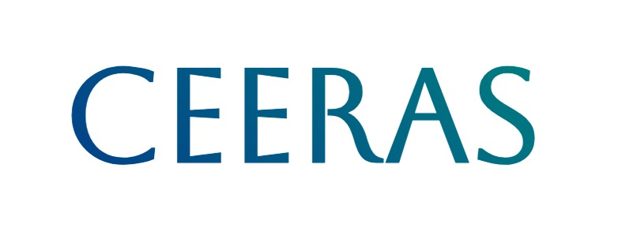

<h1 align="center">Hello 👋, I'm Sighakolli Venkata Ram Vijesh</h1>

<h3 align="center">👨‍💻 Passionate MERN Stack Developer</h3>

  ✍️ I’m currently learning <b>ReactJS, NodeJS, ExpressJS, MongoDB</b> 
  💼 Checkout my Portfolio 👉 <a href="https://vijesh-website.vercel.app/home.html" target="_blank">My Portfolio</a> 
  📧 Reach me at: <a href="mailto:ramsighakolli@gmail.com">My mail</a>

    
  

  

### 🌐 Connect with me:

  
  
  
  
  
  
  
  

---

### 🛠️ Languages and Tools:

  
  
  
  
  
  
  
  
  
  
  
  
  
  
  
  
  
  
  
  
  

<h3>🚀 My Experience </h3>

  &nbsp;&nbsp;
  
  &nbsp;&nbsp;&nbsp;&nbsp;&nbsp;&nbsp;&nbsp;&nbsp;
  

<h3>🚀 My Projects</h3>

  <table> <tr> <td>  </td> <td style="vertical-align: top; padding-left: 20px;"> <strong>Description:</strong> A MERN stack web app to schedule and track fitness coach sessions.   <strong>Tech Stack:</strong> Node.js, Express.js, MongoDB   🌐 <a href="https://hotel-booking-3t8u.onrender.com/" target="_blank">Live Demo</a>  💻 <a href="https://github.com/vijesh567/Hotel-Booking" target="_blank">GitHub Repo</a> </td> </tr> </table>

<table> <tr> <td>  </td> <td style="vertical-align: top; padding-left: 20px;"> <strong>Description:</strong> A real-time weather app built with React and the OpenWeather API.   <strong>Tech Stack:</strong> React.js, JavaScript   🌐 <a href="https://weatherapp-duhi.onrender.com/" target="_blank">Live Demo</a>  💻 <a href="https://github.com/vijesh567/WeatherApp" target="_blank">GitHub Repo</a> </td> </tr> </table>

<table> <tr> <td>  </td> <td style="vertical-align: top; padding-left: 20px;"> <strong>Description:</strong> A MERN-based live chat platform using WebSockets and Socket.IO.   <strong>Tech Stack:</strong> MongoDB, Express.js, React.js, Node.js, Socket.IO   🌐 <a href="https://chatapp-frontend-wlqc.onrender.com/" target="_blank">Live Demo</a>  💻 <a href="https://github.com/vijesh567/chatapp" target="_blank">GitHub Repo</a> </td> </tr> </table>

  

  

---
