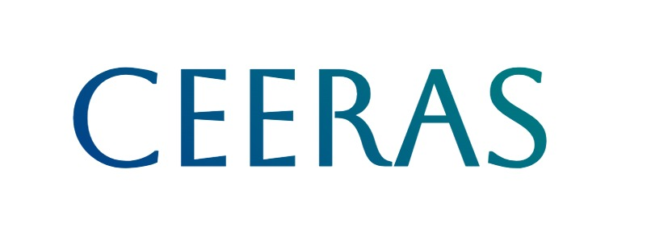

<h1 align="center">Hello 👋, I'm Vijesh Sighakolli</h1>

<h3 align="center">👨‍💻 Passionate MERN Stack Developer</h3>

  ✍️ I’m currently learning <b>React.js, Node.js, Express.js, and MongoDB</b> 
  💼 Checkout my Portfolio 👉 
  <a href="https://vijesh-website.vercel.app/home.html" target="_blank">My Portfolio</a> 
  📧 Reach me at: 
  <a href="mailto:ramsighakolli@gmail.com">ramsighakolli@gmail.com</a>

  
  

## 🌐 Connect with me:

  
  
  
  
  
  
  
  

---

## 🛠️ Languages and Tools:

  
  
  
  
  
  
  
  
  
  
  
  
  
  
  
  
  
  
  
  
  

## 🚀 Experience

  <strong>CEERAS</strong> 
  

## 🚀 Projects

### 🏋️ Fitness Coach Scheduler

**Description:**  
A MERN stack web application to schedule and track fitness coach sessions.

**Tech Stack:** Node.js, Express.js, MongoDB  
🌐 [Live Demo](https://hotel-booking-3t8u.onrender.com/)  
💻 [GitHub Repo](https://github.com/vijesh567/Hotel-Booking)

---

### 🎥 NeoJoin

**Description:**  
A real-time video meeting and chat application for team collaboration.

**Tech Stack:** React.js, JavaScript  
💻 [GitHub Repo](https://github.com/vijesh567/NeoJoin)

---

### 🤝 ProHub

**Description:**  
A MERN-based application for collaboration and working with talents.

**Tech Stack:** MongoDB, Express.js, React.js, Node.js, Socket.IO  
💻 [GitHub Repo](https://github.com/vijesh567/ProHub)

  

  

